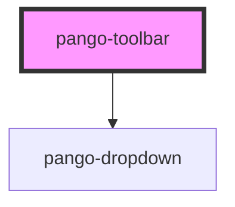

# pango-toolbar

<!-- Auto Generated Below -->

## Properties

| Property         | Attribute          | Description | Type     | Default               |
| ---------------- | ------------------ | ----------- | -------- | --------------------- |
| `headerSubTitle` | `header-sub-title` |             | `string` | `'Human Functionome'` |
| `headerTitle`    | `header-title`     |             | `string` | `'PAN-GO'`            |
| `pangoHome`      | `pango-home`       |             | `string` | `'/'`                 |

## Dependencies

### Depends on

- [pango-dropdown](../pango-dropdown)

### Graph

----------------------------------------------

*Built with [StencilJS](https://stenciljs.com/)*
